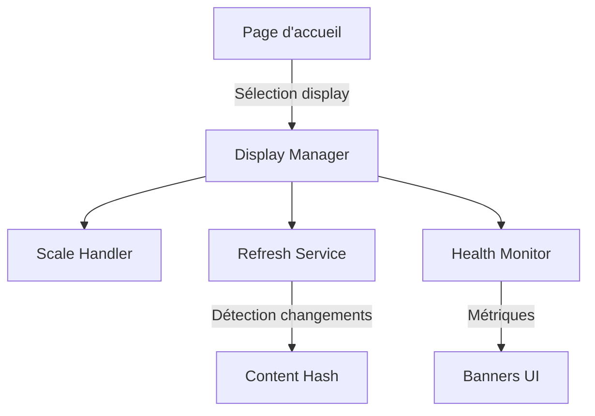

# HuddleBoard Documentation

## Table des matières

1. [Introduction](#introduction)
2. [Architecture](#architecture)
3. [Installation](#installation)
4. [Configuration](#configuration)
5. [Utilisation](#utilisation)
6. [Fonctionnalités](#fonctionnalités)
7. [API Reference](#api-reference)
8. [Déploiement](#déploiement)
9. [Monitoring](#monitoring)
10. [Dépannage](#dépannage)
11. [Sécurité](#sécurité)
12. [Performance](#performance)
13. [Contribution](#contribution)
14. [Licence](#licence)

## Introduction

HuddleBoard est un système d'affichage dynamique conçu pour fonctionner 24/7 sur des écrans dédiés. Il permet d'afficher et de rafraîchir automatiquement du contenu HTML avec mise à l'échelle automatique et détection des changements.

### Cas d'usage principaux

- Tableaux de bord en temps réel
- Affichage d'informations en entreprise
- Écrans d'information publique
- Monitoring et supervision

### Caractéristiques clés

- ✅ Rafraîchissement automatique intelligent
- ✅ Mise à l'échelle adaptative du contenu
- ✅ Détection des modifications
- ✅ Monitoring de santé intégré
- ✅ Gestion d'erreurs robuste
- ✅ Optimisé pour fonctionnement 24/7

## Architecture

### Structure des fichiers

```
huddleboard/
├── index.html              # Page d'accueil avec liste des displays
├── config.js              # Configuration des displays
├── display/
│   └── index.html         # Moteur d'affichage principal
└── displays/              # Dossier contenant les contenus
    ├── projet/
    │   └── index.html
    └── autre-display/
        └── index.html
```

### Composants principaux



### Classes principales

| Classe | Responsabilité |
|--------|---------------|
| `Core` | Initialisation et gestion du cycle de vie |
| `DisplayManager` | Gestion de l'iframe et orchestration |
| `ScaleHandler` | Mise à l'échelle adaptative |
| `RefreshService` | Rafraîchissement et détection des changements |
| `HealthMonitor` | Surveillance et statistiques |

## Installation

### Prérequis

- Serveur web (Apache, Nginx, IIS, etc.)
- Navigateur moderne (Chrome recommandé pour usage 24/7)
- Contenu HTML à afficher

### Installation basique

1. **Cloner ou télécharger les fichiers**
   ```bash
   git clone https://github.com/votre-repo/huddleboard.git
   cd huddleboard
   ```

2. **Configurer le serveur web**
   
   Exemple Nginx :
   ```nginx
   server {
       listen 80;
       server_name huddleboard.local;
       root /var/www/huddleboard;
       
       location / {
           try_files $uri $uri/ =404;
       }
       
       # Désactiver le cache pour les displays
       location /displays/ {
           add_header Cache-Control "no-cache, no-store, must-revalidate";
           add_header Pragma "no-cache";
           expires 0;
       }
   }
   ```

3. **Créer votre premier display**
   ```bash
   mkdir displays/mon-display
   echo "<h1>Mon premier display</h1>" > displays/mon-display/index.html
   ```

## Configuration

### Structure de configuration (config.js)

```javascript
window.AppConfig = {
    // Configuration globale (optionnelle)
    defaultRefreshInterval: 30000,  // 30 secondes par défaut
    
    // Liste des displays
    displays: [
        {
            name: "Tableau de bord",              // Nom affiché
            slug: "dashboard",                    // Identifiant URL
            path: "displays/dashboard/index.html", // Chemin du fichier
            refreshInterval: 15000,               // Intervalle spécifique (optionnel)
            description: "KPIs temps réel"        // Description (optionnelle)
        }
    ]
};
```

### Options de configuration

| Propriété | Type | Défaut | Description |
|-----------|------|--------|-------------|
| `name` | string | requis | Nom d'affichage du display |
| `slug` | string | requis | Identifiant unique pour l'URL |
| `path` | string | requis | Chemin relatif vers le fichier HTML |
| `refreshInterval` | number | 30000 | Intervalle de rafraîchissement en ms |
| `description` | string | null | Description optionnelle |

### Variables d'environnement avancées

Ajoutez dans config.js pour personnaliser le comportement :

```javascript
window.AppConfig = {
    // ... displays ...
    
    // Options avancées
    maxConsecutiveErrors: 10,      // Erreurs avant ralentissement
    memoryThresholdMB: 1500,       // Seuil mémoire pour alerte
    autoReloadHours: 12,           // Reload préventif
    networkTimeout: 10000,         // Timeout réseau en ms
    iframeLoadTimeout: 30000,      // Timeout chargement iframe
    enableHealthMonitor: true,     // Activer le monitoring
    debugMode: false              // Mode debug (logs verbose)
};
```

## Utilisation

### Accès à l'interface

1. **Page d'accueil** : `http://votre-serveur/`
   - Liste tous les displays configurés
   - Cliquez sur un display pour l'ouvrir

2. **Accès direct à un display** : `http://votre-serveur/display/#/slug-du-display`
   - Remplacez `slug-du-display` par le slug configuré

### Création d'un display

1. **Créer le dossier**
   ```bash
   mkdir displays/nouveau-display
   ```

2. **Créer le contenu HTML**
   ```html
   <!-- displays/nouveau-display/index.html -->
   <!DOCTYPE html>
   <html>
   <head>
       <meta charset="UTF-8">
       <title>Mon Display</title>
       <style>
           body {
               font-family: Arial, sans-serif;
               margin: 20px;
           }
       </style>
   </head>
   <body>
       <h1>Contenu du display</h1>
       <p>Dernière mise à jour : <span id="time"></span></p>
       
       <script>
           document.getElementById('time').textContent = new Date().toLocaleString();
       </script>
   </body>
   </html>
   ```

3. **Ajouter à la configuration**
   ```javascript
   {
       name: "Nouveau Display",
       slug: "nouveau-display",
       path: "displays/nouveau-display/index.html",
       refreshInterval: 60000
   }
   ```

## Fonctionnalités

### 1. Rafraîchissement intelligent

Le système vérifie périodiquement si le contenu a changé :

- Calcul d'un hash du contenu
- Comparaison avec le hash précédent
- Rechargement uniquement si modification détectée

### 2. Mise à l'échelle automatique

Le contenu est automatiquement adapté à la taille de l'écran :

- Mesure des dimensions du contenu
- Calcul du facteur d'échelle optimal
- Application de la transformation CSS
- Réajustement lors du redimensionnement

### 3. Indicateurs visuels

**Bannière de statut** (coin supérieur droit)
- 🟢 Vert : Connexion OK
- 🔴 Rouge : Erreur de connexion

**Bannière de modification** (coin inférieur droit)
- Affiche l'heure de la dernière modification détectée

**Bannière de santé** (coin inférieur gauche)
- Uptime : Temps depuis le démarrage
- Refresh : Nombre de rafraîchissements
- Err : Nombre d'erreurs

### 4. Gestion d'erreurs

- Timeout sur les requêtes réseau
- Retry automatique en cas d'échec
- Ralentissement progressif si erreurs répétées
- Reload préventif toutes les 12 heures

### 5. Monitoring de santé

- Surveillance de l'utilisation mémoire
- Détection des fuites mémoire
- Statistiques en temps réel
- Logs d'erreurs

## API Reference

### Objets globaux

#### window.AppConfig

Configuration principale de l'application.

```javascript
window.AppConfig = {
    displays: Array<DisplayConfig>,
    defaultRefreshInterval?: number,
    // ... autres options
}
```

### Classes

#### HealthMonitor

```javascript
class HealthMonitor {
    stats: {
        startTime: number,
        refreshCount: number,
        errorCount: number,
        lastError: Error | null,
        memoryWarnings: number
    }
    
    recordRefresh(): void
    recordError(error: Error): void
    checkHealth(): void
    updateHealthBanner(): void
}
```

#### RefreshService

```javascript
class RefreshService {
    constructor(display: DisplayConfig, iframe: HTMLIFrameElement)
    
    refresh(): Promise<void>
    calculateHash(text: string): string
    buildUrl(): string
    cleanup(): void
}
```

### Événements

L'application émet des événements dans la console :

```javascript
// Refresh réussi
console.log('Refresh successful', { hash, timestamp });

// Erreur
console.error('Refresh failed', { error, consecutiveErrors });

// Avertissement mémoire
console.warn('High memory usage', { usage, threshold });
```

## Déploiement

### Déploiement production

1. **Optimisation des assets**
   ```bash
   # Minifier le JavaScript
   uglifyjs display/index.html -o display/index.min.html
   ```

2. **Configuration serveur**
   - Activer la compression gzip
   - Configurer les en-têtes de cache appropriés
   - Activer HTTPS si nécessaire

3. **Configuration pour écrans dédiés**

   **Chrome en mode kiosk :**
   ```bash
   chrome.exe --kiosk \
              --disable-infobars \
              --disable-session-crashed-bubble \
              --disable-background-timer-throttling \
              --disable-renderer-backgrounding \
              --no-first-run \
              "http://serveur/display/#/dashboard"
   ```

### Déploiement avec ThinManager

Voir la section [Configuration ThinManager](#configuration-thinmanager) pour les détails spécifiques.

### Docker

```dockerfile
FROM nginx:alpine
COPY . /usr/share/nginx/html
COPY nginx.conf /etc/nginx/conf.d/default.conf
EXPOSE 80
```

## Monitoring

### Métriques à surveiller

1. **Disponibilité**
   - Uptime du service
   - Temps de réponse HTTP

2. **Performance**
   - Temps de chargement des displays
   - Utilisation CPU/Mémoire du navigateur

3. **Fiabilité**
   - Taux de succès des rafraîchissements
   - Nombre d'erreurs par heure

### Integration avec des outils de monitoring

**Prometheus metrics endpoint :**
```javascript
// À ajouter dans votre display
window.metrics = {
    refresh_total: healthMonitor.stats.refreshCount,
    errors_total: healthMonitor.stats.errorCount,
    uptime_seconds: (Date.now() - healthMonitor.stats.startTime) / 1000
};
```

**Logs structurés :**
```javascript
console.log(JSON.stringify({
    level: 'info',
    event: 'refresh',
    display: display.slug,
    timestamp: new Date().toISOString(),
    success: true
}));
```

## Dépannage

### Problèmes courants

#### Le display ne se charge pas

1. Vérifier la console du navigateur (F12)
2. Vérifier que le chemin dans config.js est correct
3. Tester l'accès direct au fichier HTML
4. Vérifier les permissions du serveur

#### Le rafraîchissement ne fonctionne pas

1. Vérifier la bannière de statut (coin supérieur droit)
2. Consulter les logs dans la console
3. Tester manuellement l'URL avec timestamp
4. Vérifier les en-têtes Cache-Control

#### Utilisation mémoire élevée

1. Vérifier la bannière de santé
2. Réduire l'intervalle de rafraîchissement
3. Simplifier le contenu du display
4. Activer le reload préventif

### Logs de diagnostic

Activer le mode debug dans config.js :
```javascript
window.AppConfig = {
    debugMode: true,
    // ...
};
```

### Commandes utiles

```bash
# Vérifier l'utilisation mémoire Chrome
ps aux | grep chrome

# Logs en temps réel (Linux)
tail -f /var/log/nginx/access.log

# Test de charge
ab -n 1000 -c 10 http://serveur/displays/dashboard/index.html
```

## Sécurité

### Bonnes pratiques

1. **Isolation réseau**
   - Placer les écrans sur un VLAN dédié
   - Limiter l'accès au serveur HuddleBoard

2. **HTTPS**
   - Utiliser HTTPS même en réseau local
   - Certificats auto-signés acceptables en interne

3. **Authentification** (si nécessaire)
   ```nginx
   location /display/ {
       auth_basic "Display Access";
       auth_basic_user_file /etc/nginx/.htpasswd;
   }
   ```

4. **Content Security Policy**
   ```html
   <meta http-equiv="Content-Security-Policy" 
         content="default-src 'self'; script-src 'self' 'unsafe-inline';">
   ```

### Considérations de sécurité

- Les displays peuvent exécuter du JavaScript
- Éviter d'afficher du contenu non fiable
- Surveiller les logs pour détecter les anomalies
- Maintenir le serveur à jour

## Performance

### Optimisations recommandées

1. **Contenu des displays**
   - Limiter les animations CSS complexes
   - Optimiser les images (WebP, compression)
   - Minimiser les requêtes externes

2. **Configuration serveur**
   ```nginx
   # Compression
   gzip on;
   gzip_types text/html text/css application/javascript;
   
   # Keep-alive
   keepalive_timeout 65;
   
   # Cache statique
   location ~* \.(jpg|jpeg|png|gif|ico|css|js)$ {
       expires 1h;
   }
   ```

3. **Optimisations navigateur**
   - Désactiver les extensions inutiles
   - Limiter les onglets ouverts
   - Utiliser un profil Chrome dédié

### Benchmarks

| Métrique | Valeur cible | Notes |
|----------|--------------|-------|
| Temps de chargement initial | < 3s | Réseau local |
| Utilisation mémoire | < 500MB | Par display |
| CPU au repos | < 5% | Sans animations |
| Uptime | > 99.9% | Sur 30 jours |

## Contribution

### Signaler un bug

1. Vérifier les issues existantes
2. Créer une issue avec :
   - Description du problème
   - Étapes pour reproduire
   - Configuration utilisée
   - Logs pertinents

### Proposer une amélioration

1. Discuter de l'idée dans une issue
2. Fork le projet
3. Créer une branche feature
4. Soumettre une pull request

### Standards de code

- Indentation : 4 espaces
- Commentaires en français
- JSDoc pour les fonctions publiques
- Tests pour les nouvelles fonctionnalités

## Licence

MIT License - Voir fichier LICENSE pour les détails.

---

*Documentation générée le 03/06/2025 - Version 1.0*